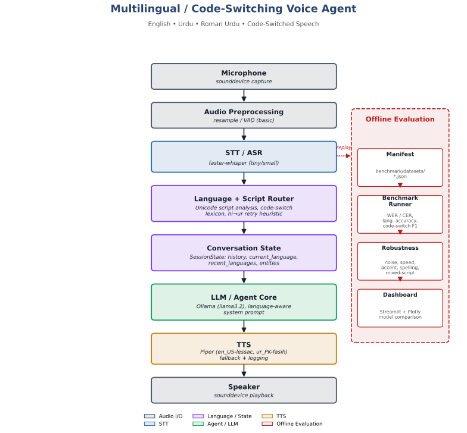

# Multilingual / Code-Switching Voice Agent

A local-first voice agent that understands and responds in **English, Urdu, Roman Urdu, and code-switched speech** -- built as a reproducible research platform, not just a chatbot. It quantifies how STT, language/script detection, LLM reasoning, and TTS interact and degrade across languages, noise, speaking rate, and code-switching, with a full benchmark harness and dashboard.



## What it does

- Captures speech from a microphone (or a file)
- Transcribes it with **faster-whisper**, with a router that corrects a known Whisper failure mode (Urdu speech misdetected as Hindi)
- Detects language, script, and code-switching using Unicode script analysis + a transparent Roman Urdu lexicon
- Responds via a local LLM (**Ollama / llama3.2**) that preserves the user's language style instead of always translating to English
- Speaks the reply back with **Piper TTS** (native English and Urdu voices, with a logged fallback for Roman Urdu)
- Benchmarks itself: WER/CER, language accuracy, code-switch F1, latency, and robustness under noise/speed/accent/spelling/mixed-script variation, all viewable in a Streamlit dashboard

## Quickstart

```powershell
# 1. Clone and install
git clone https://github.com/aainabatool/multilingual-voice-agent.git
cd multilingual-voice-agent
uv sync

# 2. Install Ollama and pull a model
# https://ollama.com/download
ollama pull llama3.2

# 3. Download the TTS voices (not committed to the repo -- see models/ .gitignore)
uv run python -m piper.download_voices en_US-lessac-medium
uv run python -m piper.download_voices ur_PK-fasih-medium
mkdir models\tts
Move-Item en_US-lessac-medium.onnx*, ur_PK-fasih-medium.onnx* -Destination models\tts\

# 4. Try the live voice loop
uv run python -m scripts.run_voice_loop
```

## Project structure
app/ Core application: audio I/O, STT, language/script detection, agent, TTS
benchmark/ Datasets, metrics (WER/CER, language accuracy, code-switch F1), runners
dashboard/ Streamlit + Plotly benchmark dashboard
data/audio/ Sample and robustness-test audio fixtures
docs/ Findings, limitations, architecture diagram
scripts/ Entry points (voice loop, benchmark runner, fixture generators)
tests/ pytest suite (one file per component)

## Running the benchmark

```powershell
# Run the core benchmark (English / Urdu / Roman Urdu)
uv run python -m benchmark.runners.run_benchmark small benchmark/datasets/manifest.json

# Run the robustness suite (noise, speed, accent, spelling variation, mixed script)
uv run python -m benchmark.runners.run_benchmark small benchmark/datasets/manifest_robustness.json

# View results
uv run streamlit run dashboard/dashboard_app.py
```

Reports are written as JSON to `benchmark/reports/` (gitignored) and compared side by side in the dashboard.

## Findings & limitations

Full write-ups, including honest answers to the project's 8 research questions and real bugs found along the way:
- [`docs/FINDINGS.md`](docs/FINDINGS.md)
- [`docs/LIMITATIONS.md`](docs/LIMITATIONS.md)

Highlights:
- **faster-whisper `small` beats `tiny` on both accuracy and latency** for this multilingual use case -- a counterintuitive but measured result.
- Whisper's auto-detect **frequently confuses Urdu with Hindi**; a router that retries with a forced language fixes this reliably (confidence 0.72-0.93 -> 1.00).
- A genuine **Windows-specific Piper bug** was found and fixed: its CLI reads stdin using the OS console codepage instead of UTF-8, silently corrupting Urdu/Arabic-script text.
- **Script mismatch is a real measurement confound**: forcing Whisper to transcribe in Urdu converts Roman Urdu speech into Urdu script, which breaks naive WER/CER comparison against a Latin-script reference. This is documented rather than papered over.

## Tech stack

STT: faster-whisper &middot; LLM: Ollama (llama3.2) &middot; TTS: Piper &middot; Dashboard: Streamlit + Plotly &middot; Package management: uv

## Status

All 9 phases of the original specification are complete: repo setup, STT baseline, language/script detection, agent core, TTS, end-to-end voice loop, benchmark harness, dashboard, and robustness testing.

